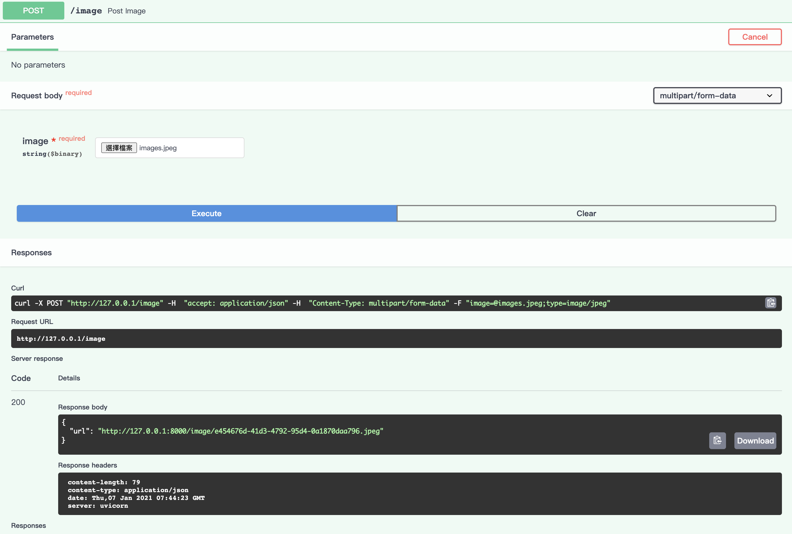
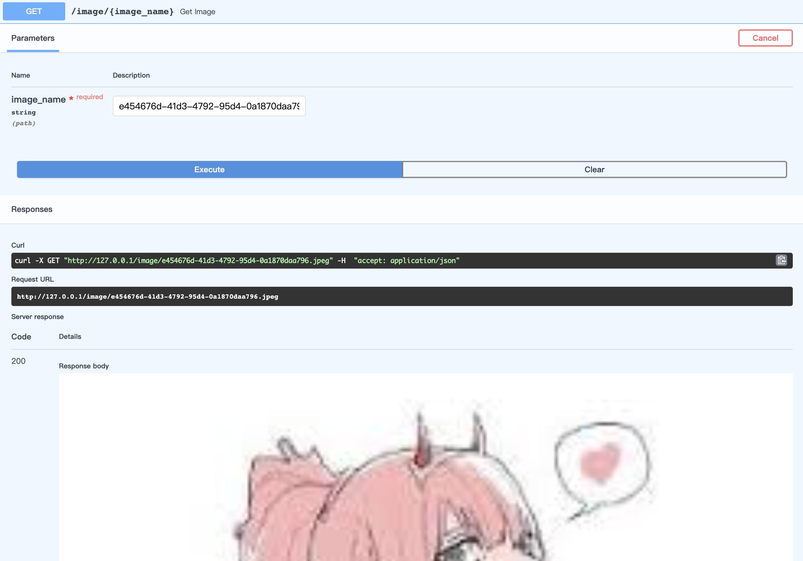

# Question 2 
Implement simple web server in a Docker container which exposes apis to upload and retrieve image from server
## API
* Upload File
    
* Download File
    

## Running the Code
### Requirements
* Python 3.6+
* Virturlenv

### Setup
For server configs please see 
```shell script
app/main.py
```
__ORIGINAL_FOLDER__ is the folder which saves the original image

__COMPRESS_FOLDER__ is the folder which saves the compressed image

__SERVER_HOST__ you would need to change this accordingly if you are not working on **localhost** and port **8000**
```python
SERVER_HOST = 'http://127.0.0.1:8000'
ORIGINAL_FOLDER = 'uploads/original/'
COMPRESS_FOLDER = 'uploads/compress/'
```
Create virtualenv & activate
```shell script
$ virtualenv venv -p python3 && source venv/bin/activate
```
Install required pip
```shell script
$ pip install -r requirements.txt
```
Start uvicorn server
```shell script
$ uvicorn app.main:app --reload
```
Now you should be able to access the server on http://127.0.0.1:8000

You can access API docs at http://127.0.0.1:8000/docs

## Build and run Docker
```shell script
$ docker build -t api_image .
$ docker run -d --name api_container -p 8000:80 api_image 
```


